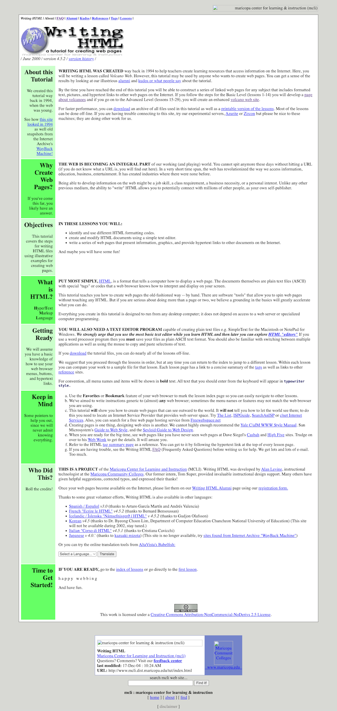

# writing-html-tut

Archive for the "Writing HTML" Tutorial from Maricopa Community College

> 💡 **Tip**
>
> It is still online as a mirror here: https://mcli.cogdogblog.com/tut/
>
> I've decided to host a version just for nostalgia and preservation of a good resource. :)

## Introduction

This is a mirror repository of the "Writing HTML" tutorial originally written by instructors at **Maricopa Community College**.

I personally learned HTML in the late 1990s with this very same tutorial. It is well written and fun to follow.

Although nowadays we're using HTML5, the tutorial is still relevant in some ways and can help someone just starting out learning what HTML is in an organized paced.

The website looked like this:

## Viewing

You will find all the files in `html_tut`. The starting page is `start.html`. You can view the site locally in any modern web browser. Most files are downloaded, so broken links should be minimal if referencing anything related to the tutorial. (Of course, external links may take you to no where nowadays.)

## Archived ZIP

Additionally, the original ZIP archive is also included in this repository as `writinghtml.zip`.

Why? Data hoarding, I suppose.
